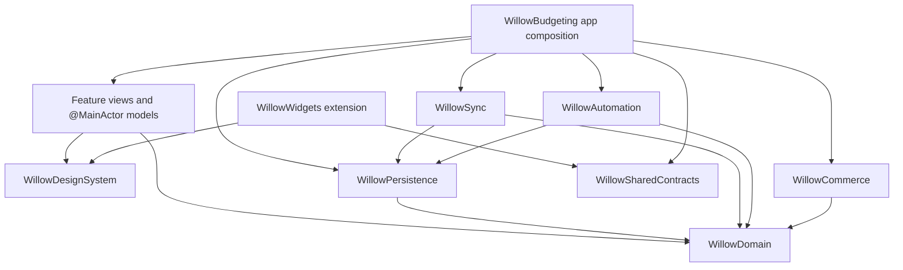

@/Users/lucas/.codex/RTK.md

# AGENTS.md: Willow Budgeting Native iOS Migration Playbook

This file is the execution source of truth for migrating the current Expo React Native app in this repository to a fully native Swift and SwiftUI app in a new repository.

## Mission

Create a new repository named `willow-budgeting` with an Xcode project named `WillowBudgeting` and the display name **Willow Budgeting**. The result must:

- contain no React Native, Expo, Metro, EAS, JavaScript, TypeScript, CocoaPods, or bridge runtime in the shipping iOS app;
- preserve every confirmed production feature and all existing user data;
- preserve CloudKit, sharing, widgets, App Intents, Shortcuts, notifications, StoreKit entitlements, deep links, and upgrade continuity;
- replace test/demo data and dead code with a smaller, typed, testable native architecture;
- be shippable as an in-place App Store update unless the owner explicitly chooses a separate app;
- remain buildable and testable at the end of every phase;
- improve correctness, responsiveness, accessibility, privacy, and maintainability without combining the cutover with avoidable product redesign.

Do not create the new repository or begin implementation until the owner approves the Phase 0 identity decision. This document records the audit and the work order.

## How agents must use this file

- Prefix every shell command with `rtk`.
- Keep edits scoped and preserve unrelated modified or untracked files; this repository is frequently used for parallel work.
- Work in phase order. A later phase may be spiked, but it may not be declared complete while an earlier dependency is open.
- Update the phase checklist and the migration ledger in the new repository as work lands.
- Keep the current React Native repository available as the behavioral and data-compatibility reference until the native App Store release is stable.
- Never delete or rewrite user data to make a test pass.
- Never copy demo code into production merely because it is already Swift.
- Every behavior change from the React Native app must be named in an ADR and backed by a test.
- Do not modify CloudKit production schema, technical identifiers, StoreKit products, or signed capabilities without explicit owner approval.
- A phase is complete only when its exit gate is proven with commands, fixtures, screenshots, or physical-device evidence as specified below.

## Audit snapshot

Audit date: **2026-07-09**

Current repository:

- Expo SDK 56, React Native 0.85, React 19, TypeScript 6.
- Entry point is `expo-router/entry`.
- Primary dashboard navigation is manually coordinated in `App.tsx`.
- Routed native-first flows exist at `/expense` and `/income`.
- Production persistence is SQLite, not `src/data.ts`.
- CloudKit sync is a custom SQLite-to-CloudKit system with private and shared databases.
- Existing local SwiftUI implementations are exposed through Expo modules.
- Current minimum iOS version is 17.0.
- The current Xcode project builds with Swift language mode 5 even though the installed toolchain is Xcode 26.6 and Swift 6.3.3.
- The app declares iPhone and iPad support.

Verified baseline:

```bash
rtk npm run typecheck
rtk npm test
rtk npm run test:repo
```

Results at audit time:

- TypeScript typecheck: pass.
- Full Node suite: **132/132 pass**.
- Repository-focused suite: **36/36 pass**.
- `xcodebuild -list`: app target `financeapp`, widget target `FinanceWidgets`.
- The shared app scheme references a test bundle that does not exist.

Legacy repository commands:

```bash
rtk npm start
rtk npm run ios
rtk npm run android
rtk npm run web
rtk npm run typecheck
rtk npm test
rtk npm run test:repo
```

After changing a current native Swift module, also build the touched scheme. For example:

```bash
rtk xcodebuild -workspace ios/financeapp.xcworkspace -scheme GlassCard -configuration Debug -sdk iphonesimulator -destination 'generic/platform=iOS Simulator' build
```

Repository safety warning:

- The entire `ios/` directory is ignored by `.gitignore`.
- The Xcode project, app delegate, entitlements, Info.plist, privacy manifest, generated App Intent copy, and `FinanceWidgets.swift` are therefore not reproducible from a clean clone.
- There is no config plugin that recreates the widget target.
- Before migration begins, verify an archived build to learn whether the widget ever shipped.
- Several current native chart/sheet and React Native screen files are modified, and `NativeBudgetCategorySheetView.swift` plus its TypeScript wrapper are untracked. The owner must decide which work-in-progress changes belong in the baseline before it is tagged.

Documentation warning:

- `README.md` and `CLAUDE.md` are stale. They incorrectly describe the app as mock-data-only, router-free, persistence-free, and test-free. Do not use them as architectural sources.
- `PRODUCT.md`, `DESIGN.md`, the code, tests, and the playbooks under `docs/` are the current references.

## Phase 0 decisions

Record the outcome of each decision in `Migration/ADR/` in the new repository. Defaults below are the safest audit recommendations, not silent authorization to change product scope.

| ID | Decision | Recommended default | Why it matters |
|---|---|---|---|
| D-001 | Is Willow Budgeting the same installed App Store app or a separate app? | Same installed app, new repository and display name | A separate bundle cannot read the existing sandbox database and breaks automatic continuity for CloudKit shares, widgets, subscriptions, and Shortcuts. |
| D-002 | Deployment target | Keep iOS 17.0 for the first native release | The current app supports iOS 17. iOS 18 and iOS 26 APIs need tested fallbacks unless the owner intentionally drops users. |
| D-003 | iPad support | Keep it | The current target declares iPad. Native layouts must become adaptive instead of silently dropping support. |
| D-004 | Subscription launch behavior | Explicit owner decision before UI implementation | Startup gating is disabled today and the paywall is demo-grade. Either build a real subscription experience or remove trial language and gating. |
| D-005 | Irregular income semantics | Define once and apply everywhere | One-time income is included in Budget but inconsistently excluded from Home, Insights, widgets, and weekly summaries. |
| D-006 | Goal normalization | Keep legacy category metadata and contribution transactions as the first-release sync authority; any normalized tables are local, derived, and rebuildable | A new authoritative table without a new CloudKit type would break multi-device behavior, while a new record type would violate the no-schema-change compatibility gate. |
| D-007 | Attachments | Preserve existing rows; treat the feature as dormant until CKAsset transfer is built | Current sync sends a device-local URI, not receipt bytes. |
| D-008 | CloudKit engine | Run a time-boxed `CKSyncEngine` compatibility spike; fall back to a typed extraction of the current engine if any gate fails | iOS 17 supports `CKSyncEngine`, but wire compatibility and conflict behavior are more important than adopting a newer API. |
| D-009 | Technical identifiers | Rename display/product text only for the first release | Identifiers are data and entitlement contracts, not branding. |
| D-010 | Finance amount semantics | Preserve existing major-unit values and currency display behavior during cutover | Do not mix a money-storage conversion with the runtime migration. Use `Decimal` in the domain and adapt legacy `REAL` at boundaries. |
| D-011 | Known sample rows on existing devices | Preserve by default | Seed rows may have been edited. Never delete them by ID heuristic. Offer a reviewed cleanup action if needed. |
| D-012 | Incomplete Settings rows | Owner classifies each as implement, omit, or explicitly post-release | Export, Help, Privacy, and Terms currently only show “coming soon.” Privacy and Terms must be real before a subscription release. |
| D-013 | Profile-avatar coexistence | Read legacy base64 and dual-write it within a documented size cap while legacy clients remain supported; defer CKAsset-only writes | A new asset reference or field would be invisible to the React Native client and could erase a user-visible avatar during coexistence. |
| D-014 | Supported input databases | Support fresh/empty v0 and every schema version v1 through v12 unless an evidence-backed ADR narrows the matrix | Users can skip releases. “Versions we happened to recover” is not a safe upgrade contract. |
| D-015 | App Store version authority | Record the latest App Store/TestFlight/EAS values; make Release `CURRENT_PROJECT_VERSION` greater and align app/extension versions | A correct binary can still be rejected or fail to update if its version lineage is wrong. |
| D-016 | File protection | Default DB/WAL/SHM and the background automation inbox to `completeUntilFirstUserAuthentication`; use `complete` for backups/media that do not require locked-device access, then prove the policy on hardware | App Intents may need to enqueue while the phone is locked, but financial data still needs an explicit protection policy. |
| D-017 | Rollout observability | Approve privacy-safe health signals, thresholds, cohort duration, stop conditions, and a rollback owner before implementation | “No data loss” and “soak passed” are not testable without observable success criteria. |

### Continuity identifiers

For an in-place App Store update, preserve these exact contracts in the first Willow release:

| Contract | Existing value |
|---|---|
| App bundle identifier | `com.lucasmartin.financeapp` |
| Widget bundle identifier | `com.lucasmartin.financeapp.widgets` |
| Development team currently seen in the generated project | `J8U9J4FYQZ` |
| CloudKit container | `iCloud.com.lucasmartin.financeapp` |
| App Group | `group.com.lucasmartin.financeapp.widgets` |
| Legacy URL scheme | `financeapp` |
| SQLite path | `Documents/SQLite/finance-app.db` |
| SQLite baseline | `PRAGMA user_version = 12` |
| Widget snapshot key | `finance_widget_snapshot` |
| Widget kind identifiers | `AvailableToSpendWidget`, `BudgetProgressWidget`, `UpcomingBillsWidget`, `QuickAddWidget` |
| Notification identifier prefix | `finance-app:` |
| Legacy CloudKit UserDefaults queues | `CloudKitSyncRemoteChanges`, `CloudKitSyncAcceptedShares` |
| CloudKit zone convention | `zone-<ledgerId>` |
| StoreKit products | `pro_weekly`, `pro_monthly`, `pro_yearly` |
| StoreKit subscription group | `4205BB53` |
| Legacy deep-link grammar | `financeapp:///`, `/expense?mode=manual|voice`, `/income`; automation keys `source`, `autoSave`, `preview`, `replay`, `text`, `amount`, `merchant`, `category`, `date`, `cardLast4` |
| Existing App Intents | Preserve archived intent identifiers, Swift type names, parameter identities/order/defaults, phrases, output behavior, and `openAppWhenRun` behavior |

The app may additionally register `willow://`, but it must keep the complete `financeapp://` route grammar for at least the compatibility window. Treat query names and value spellings as API. Capture the last shipped archive's App Intents metadata rather than assuming a matching Swift type name is sufficient. Preserve or deliberately drain the two legacy CloudKit queues before removing their keys. Do not change the explicit CloudKit container to rely on `CKContainer.default()` after a rename.

If the owner chooses a separate bundle, stop this plan at Phase 0. First ship a bridge release of the old app that exports data or moves the database into a shared App Group. A new bundle alone cannot import the old sandbox.

## Definition of done

The migration is complete only when all of the following are true:

- [ ] The shipping target contains no React Native or Expo runtime.
- [ ] Every production screen and interaction in the inventory is marked migrated, intentionally merged, or owner-approved for omission.
- [ ] Upgrade-in-place from the last shipped React Native/TestFlight build preserves data, settings, media, CloudKit state, shares, pending imports, widgets, deep links, and StoreKit entitlement.
- [ ] The native app can fresh-install without fake transactions, fake income, fake bills, or fake historical charts.
- [ ] The native app and a legacy React Native client can coexist against the same development CloudKit ledger during the compatibility window.
- [ ] All ported domain behavior has fixture parity or an approved ADR explaining the intentional change.
- [ ] App, widget, unit-test, UI-test, and performance-test targets are source-controlled and reproducible from a clean clone.
- [ ] Swift 6 strict concurrency passes without suppressing real isolation problems.
- [ ] No database, file, network, parser, image decode, or chart aggregation work blocks the main actor beyond the measured budget.
- [ ] Accessibility, Dynamic Type, Reduce Motion, Increase Contrast, localization infrastructure, and iPad layouts pass.
- [ ] StoreKit, CloudKit sharing, silent push, App Intents, widgets, Face ID, speech, and photo flows pass on physical devices.
- [ ] A rollback-compatible backup exists before first native database mutation.
- [ ] App and extension marketing/build versions satisfy D-015 in the signed archive.
- [ ] TestFlight soak and staged App Store rollout meet the ratified D-017 health thresholds with no migration-integrity failure.

# Existing application map

## Current shell and navigation

`App.tsx` is a 2,000-plus-line composition root. It keeps five full-screen layers mounted and crossfades them manually:

- Home
- Insights
- Insight detail
- Budget
- Activity

It also owns the drawer, tabs, goals, settings, appearance, profile, notifications, sharing, widgets, onboarding, paywall, app lock, transaction and bill sheets, automation intake, CloudKit lifecycle, sync status, filters, toasts, and many demo flags.

Real Expo Router routes exist in:

- `app/_layout.tsx`
- `app/index.tsx`
- `app/expense.tsx`
- `app/income.tsx`

The web-only route files are placeholders and do not belong in an iOS-only native repository.

Behavior to preserve:

- Rapid tab taps cancel stale transitions.
- Drawer gestures exclude the tab bar and suppress accidental presses.
- Incoming routes can open voice/manual expense and income flows.
- Insight detail can hand a typed filter to Activity.
- The tab bar hides during particular keypads and overlays.
- App lock, onboarding, paywall, and dashboard gates do not overlap incorrectly.

Current defects to resolve instead of porting:

- All main screens remain mounted, including large lists and charts.
- Multiple screens render a wallpaper even though the shell also owns one.
- Drawer “Support” emits an unhandled route.
- Drawer Activity badge is hardcoded and is dropped by the native conversion.
- Native and fallback tab bars disagree on label behavior.
- Fixed host heights and dimensions are not robust iPad layouts.

## Production screen and flow inventory

| Current source | Confirmed behavior | Native destination | Disposition |
|---|---|---|---|
| `App.tsx`, `TabBar.tsx`, `Drawer.tsx` | Launch gates, tab selection, drawer, route/sheet coordination, toasts, deep links | `RootScene`, `LaunchCoordinator`, `AppRouter`, `AppTabBar`, adaptive sidebar | Rewrite with typed state and lazy destinations |
| `HomeScreen.tsx` | Month summary, available/over hero, quick actions, 50/30/20 groups, upcoming recurring bills, payment, recent activity, delete/undo, refresh | `HomeView`, `HomeViewModel`, `HomeDashboardQuery` | Migrate |
| `InsightsScreen.tsx` | 1W/1M/1Y analysis, cumulative spending, saved/trend cards, category/merchant ranking, scored insights, scrubbing | `InsightsView`, `InsightsViewModel`, `InsightEngine` | Migrate after aggregation services |
| `InsightDetailScreen.tsx` | Spending/savings/trend targets, timeframe/grain, chart, search/sort/date filters, paged recent transactions, Activity handoff | `InsightDetailView`, typed `InsightTarget` | Migrate |
| `ActivityScreen.tsx` | Keyset paging, search debounce, category/date/amount/member filters, five sorts, calendar, bill markers, delete/undo, locks | `ActivityView`, `ActivityViewModel`, `ActivityQuery`, filter/calendar sheets | Migrate early as the paging proof |
| `BudgetScreen.tsx` | Month history, income/assigned totals, allocation bar, prior-month copy, category budgets, recurring rules, goal progress, custom keypad, locks | `BudgetView`, `BudgetViewModel`, `BudgetAllocationService` | Migrate |
| `GoalsScreen.tsx` | Active/archived goals, summaries, CRUD, pause, complete, archive/restore, contributions, linked transactions, Budget handoff | `GoalsView`, `SavingsGoalService`, goal sheets | Migrate after goal compatibility model |
| `app/expense.tsx`, `ExpenseFlow.tsx` | Voice/manual entry, amount/category/merchant/note/date/repeat, recurring-rule creation, automation preview/auto-save/rejection | `ExpenseEntryView`, `ExpenseEntryViewModel`, `TransactionDraft` | Migrate |
| `app/income.tsx`, `IncomeFlow.tsx` | Regular and one-time income, cadence conversion, custom frequency, date range, CRUD, locks, keypad | `IncomeView`, `IncomeViewModel`, `IncomeCadencePolicy` | Migrate |
| `NativeTransactionSheetMount.tsx`, `NativeTransactionSheetView.swift` | Edit amount, merchant, category, date, note; delete; permissions | `TransactionEditorSheet` | Extract SwiftUI content and replace bridge API |
| `NativeUpcomingPaymentSheetMount.tsx`, `NativeUpcomingPaymentSheetView.swift` | Full/partial payment, due date, recurrence deletion, locks | `RecurringPaymentSheet` | Extract and unify with Budget bill editing |
| `NativeBudgetCategorySheetView.swift` | Category, group, budget, icon, goal fields | `BudgetCategorySheet` | Preserve current work-in-progress only after baseline approval |
| `OnboardingFlow.tsx` | Welcome, profile, income, plan, sync, preview; creates defaults and flags | `OnboardingFlowView`, idempotent `OnboardingCommitService` | Migrate production behavior |
| `FirstRunPrompt.tsx` | Prompts legacy users with no income | Legacy migration fallback | Keep only if native onboarding cannot guarantee income |
| `SettingsScreen.tsx` | Appearance, notifications, widgets, Face ID, currency, income, sharing, Apple Pay/SMS import modes and guides | `SettingsView` plus focused child features | Migrate real rows; classify placeholders |
| `ThemeScreen.tsx` | Light/dark, wallpaper tabs, custom photos, preview/apply, derived floor color | `AppearanceView`, `WallpaperStore` | Migrate; use durable downsampled files |
| `ProfileScreen.tsx` | Display name, avatar, share role, edit policy, sharing link | `ProfileView` | Migrate through the D-013 legacy-compatible avatar transition |
| `NotificationSettingsScreen.tsx` | Permission/test, bill, budget, weekly, and goal reminder preferences | `NotificationSettingsView`, `NotificationScheduler` | Migrate |
| `SharingSettingsScreen.tsx` | iCloud toggle/status, pending/conflicts, invite/manage/leave, members, edit lock | `SharingView`, `SyncDiagnosticsView`, `ConflictResolutionView` | Migrate |
| `WidgetsSetupScreen.tsx` | Widget education and quick-add test | `WidgetsHelpView` | Migrate after widget target |
| `AppLockGate.tsx` | Launch/background privacy gate with Face ID/passcode retry | `AppPrivacyGate`, `AuthenticationService` | Migrate |
| `src/paywall/*`, `NativePayWallStoreKitDemoView.swift` | Product/entitlement plumbing and startup overlay | `EntitlementStore`, production `PaywallView` if retained | Rebuild, do not mechanically port demo UI |
| `Toast.tsx`, `AppFeedbackProvider.tsx`, `NativeLGToastView.swift` | Toast and optional undo action | `FeedbackCenter`, native toast/banner | Migrate |
| `SettingsScreen.tsx` automation guides | Wallet/SMS setup, mode, run status, debug replay, recent imports | `AutomationSettingsView` | Migrate production guidance; debug replay stays Debug-only |

## Core data and business inventory

| Area | Existing source | Native disposition |
|---|---|---|
| Domain contracts | `src/repositories/types.ts` | Port semantic models with typed IDs and values; do not copy synchronous generic repository API |
| SQLite schema and migrations | `src/repositories/sqlite/db.ts` | Preserve v12 file and schema compatibility first |
| Transaction queries | `src/repositories/sqlite/transactions.ts` | Port five sorts, keyset cursors, filters, summaries, calendar marks, day/month series |
| Income | `src/repositories/sqlite/income.ts`, `selectors/finance.ts` | Port CRUD and cadence math; resolve one-time semantics |
| Categories and budgets | `categories.ts`, `budgets.ts`, `categoryUtils.ts` | Port; budget spend remains derived |
| Recurring payments | `recurringRules.ts`, `selectors/finance.ts` | Make recurring rules authoritative and derive upcoming bills |
| Legacy bills table | `bills.ts` | Preserve/import existing rows; do not keep as a second runtime source of truth |
| Goals | `selectors/goals.ts`, `GoalsScreen.tsx`, `BudgetScreen.tsx` | Typed goal domain and atomic writes over the legacy sync authority; optional rebuildable local projection |
| Attachments | `attachments.ts`, sync registry | Preserve rows/files; no production UI; implement CKAsset before claiming cross-device support |
| Settings | `settings.ts`, `ThemeProvider.tsx` | Decode legacy JSON without data loss, then expose typed app/ledger/automation/notification settings |
| Session and sharing permission | `db.ts` session functions | Actor-isolated, persisted session and ledger policy |
| Automation queue | `automationImports.ts`, `processAutomationImports.ts` | Port with atomic leases, recovery, privacy cleanup, per-ledger dedupe |
| Wallet/SMS parser | `parseTransactionIntake.ts`, tracked Swift App Intent template | Create one Swift parser shared by app and App Intents |
| Remote normalization | `normalizeTransaction.ts` | Port a minimal-data URLSession client, cache, timeout, and validation policy |
| Merchant logo policy | `merchantLogoPolicy.ts`, `merchantLogos.ts` | Port URL allowlist, TTL/backoff, cache, redaction, disk image handling |
| Notifications | `src/notifications/*` | Typed preferences and reconciliation scheduler |
| Widget snapshot | `src/widgets/*` | Port contract and preserve v1 App Group payload during cutover |
| CloudKit | `src/sync/*`, `CloudKitSyncModule.swift` | Preserve records, routes, tombstones, locks, conflicts, tokens, and sharing |
| StoreKit | `src/paywall/*`, `GlassCardModule.swift` | One verified entitlement actor and production UI |
| Voice | `src/voice/*` | Native Speech service and fixture-tested parser |
| Formatting | `currency.ts`, `selectors/format.ts` | Locale-aware formatters; preserve display semantics during cutover |
| Default catalog | category portion of `src/data.ts` | Keep as onboarding templates, not sample finances |
| Test stores | `inMemory.ts`, Node SQLite driver | Replace with temporary GRDB databases and fixture stores; do not ship |

## Database compatibility contract

Current database facts:

- File: `finance-app.db`.
- Location on iOS: `Documents/SQLite/finance-app.db`.
- Current schema version: 12.
- Configuration: foreign keys on, WAL, `synchronous=NORMAL`, five-second busy timeout.

Supported first-release input matrix:

- v0: no database/fresh install;
- v1 through v12: every historical schema version in the current migration chain;
- v12 with active WAL/SHM files;
- v12 shared-ledger, tombstone, conflict, pending-sync, pending-automation, and legacy-goal variants.

Create deterministic fixtures from historical DDL and migration code when an authentic device copy is unavailable. A version may be removed from this matrix only through D-014 after checking the oldest install that can still update from the App Store. Test every supported version to the native schema, then prove that the designated rollback React Native build can read the resulting additive schema.

Schema history that migration fixtures must represent:

1. Settings, income, transactions, budgets, categories, recurring rules, attachments, bills, merchant-logo cache.
2. Category/recurrence/attachment and additional income/transaction fields.
3. Merchant-logo table.
4. Early sample replacement.
5. Transaction query indexes.
6. Retained no-op version.
7. Merchant-logo background color.
8. Broader indexes and orphan attachment cleanup.
9. Ledgers, members, sync columns, ownership, tombstones, CloudKit metadata.
10. Sync change-token table.
11. Fake partner removal.
12. Automation-import queue and indexes.

Synced tables:

- `ledgers`
- `ledger_members`
- `transactions`
- `incomes`
- `categories`
- `budgets`
- `recurring_rules`
- `bills`
- `attachments`

Local-only tables:

- `settings`
- `merchant_logos`
- `automation_imports`
- `sync_state`

Rules to preserve:

- Transactions store positive major-unit amounts. `type` distinguishes expense/income.
- Transaction display labels are derived and must not become stored Swift fields.
- Delete is a tombstone for synced rows. Deleting a transaction tombstones its attachments in the same transaction.
- Another member can edit an item only if its creator permits it. Unknown creators are locked.
- Income monthly equivalents are weekly `52/12`, biweekly `26/12`, semimonthly times two, annual divided by 12, and custom `amount × perYear / 12`.
- Budget `spent` is derived.
- Currency currently changes formatting, not conversion.
- Recurrence preserves weekly, monthly/custom monthly, annual, end-of-month clamping, leap-year behavior, and partial-payment state.
- CloudKit local routing metadata must not upload as shared ledger metadata.
- Do not copy a SQLite main file while WAL is active. Open in place, checkpoint safely, or use SQLite backup APIs.
- Make a verified backup before the first native write.
- The first native App Store release must use only additive/backward-readable schema changes so an emergency rollback to the React Native binary can still open the database.

Legacy goal representation to decode:

- Savings category with `goalTarget`.
- `goalStartingBalance` or legacy `goalSaved`.
- `goalDeadline`.
- `goalMonthlyContribution`.
- `goalContributions`.
- `goalStatus`, `goalCompletedAt`, `goalArchivedAt`.
- Contribution transactions with `meta.kind = goal-contribution`, `goalId`, and `contributionId`.

Deduplicate goal contributions by transaction ID/contribution ID. For old goals that only stored total saved, derive starting balance as legacy saved minus contribution total.

For the first native release, legacy category metadata and linked contribution transactions remain the cross-client source of truth. A normalized `goals` or `goal_contributions` table may exist only as a rebuildable local projection. It must never be the sole write target. Creating a new synced CloudKit goal type requires a separate owner-approved schema ADR, an old-client compatibility strategy, and a later release window.

## Known defects and migration resolutions

| Finding | Resolution phase |
|---|---|
| Fresh production installs seed months of fake transactions, income, budgets, bills, and recurring rules | Phase 3: fresh native schema creates only settings, ledger/member, and owner-approved default category templates |
| Home historical cards use `SEED_MONTH_BUDGETS` | Phase 2/9: replace with actual month aggregation and parity tests |
| Unused selectors return seed period/trend/spark data | Leave behind after proving no runtime caller |
| App loads or iterates large transaction collections on screen code paths | Phase 3 and feature phases: query-specific SQL observations and pagination |
| `automation_imports.fingerprint` is globally unique although behavior is ledger-scoped | Additive migration to unique `(ledger_id, fingerprint)` after fixture proof |
| Automation jobs can remain stuck in `processing` after a crash | Add lease timestamps and stale-job recovery |
| Processed imports retain raw SMS text | Scrub raw payload after terminal handling unless explicit Debug consent exists |
| TypeScript settings can retain replay SMS text outside Debug | Do not reproduce; compile replay support only into Debug |
| App Intent parser and app parser duplicate rules | One `WillowAutomation` parser and fixture corpus |
| Bill payment, goal contribution, onboarding, and category/budget writes are not always atomic | Implement transaction-scoped use cases |
| Attachment sync sends local URI rather than bytes | CKAsset implementation or honest exclusion |
| Profile photo is base64 inside synced member metadata | D-013: preserve/read it, dual-write a capped legacy form during coexistence, and defer CKAsset-only authority to a schema-approved later release |
| Custom wallpapers retain fragile picker/cache URIs | Copy, downsample, hash, and own files under Application Support |
| Cloud delete timestamps can incorrectly beat newer local edits | Preserve server modification/deletion ordering and add regression fixture |
| Shared read-only permission is recorded but not proactively enforced for every push | Enforce in domain and sync gates |
| Date logic mixes UTC slicing with local calendar buckets | Introduce `Instant`, `LocalDate`, `MonthKey`, and one injected Calendar policy |
| One-time income semantics differ by feature | Resolve D-005 and add cross-feature fixtures |
| Startup paywall is disabled | Resolve D-004; no hidden production gate |
| Native paywall is placeholder copy, hardcoded products/links, and iOS 18-only | Rebuild with iOS 17 fallback or raise deployment target explicitly |
| No `Transaction.updates` listener | Add to `EntitlementStore` |
| Widget quick-action IDs disagree (`voice` versus `text`) | Version and unify shared contract |
| Widget reloads all timelines on every repository change | Dedupe and throttle per kind |
| Notification taps are not routed | Typed notification route handling |
| Both generated entitlements show development APS | Inspect and fix signed distribution entitlements |
| `ios/` and widget target are ignored | Phase 1 source-controlled native project |
| Main scheme references nonexistent tests | Phase 1 real unit/UI test targets and schemes |
| Wallpaper bundle is roughly 73 MB and example images roughly 12 MB | Curate, license-audit, resize, thumbnail, and exclude examples |
| No localization resources | Phase 1 String Catalog |
| `Support` drawer destination is unhandled | Classify and implement or remove in Phase 0/11 |
| Export/Help/Privacy/Terms are fake “coming soon” rows | D-012; no misleading production rows |
| Release Settings contains Empty State Preview | Move to an internal Debug menu |

# Code disposition

## Port behavior and tests

These are production contracts:

- `src/repositories/types.ts`
- `src/repositories/sqlite/`
- `src/selectors/spending.ts`
- `src/selectors/savings.ts`
- the live portions of `src/selectors/finance.ts`
- `src/selectors/goals.ts`
- `src/automation/`
- `src/merchantLogoPolicy.ts`
- `src/merchantLogos.ts`
- `src/notifications/`
- `src/sync/`
- `src/widgets/`
- `src/paywall/`
- `src/voice/`
- `plugins/apple-pay/ImportApplePayTransactionIntent.swift`
- all confirmed production screen behaviors in the inventory

## Extract and refactor existing Swift

Useful implementation references, not bridge APIs:

- `modules/cloudkit-sync/ios/CloudKitSyncModule.swift`
- `modules/glass-card/ios/NativeTransactionSheetView.swift`
- `modules/glass-card/ios/NativeUpcomingPaymentSheetView.swift`
- `modules/glass-card/ios/NativeBudgetCategorySheetView.swift`
- `modules/glass-card/ios/NativeSpendLineChartView.swift`
- `modules/glass-card/ios/NativeTrendBarsChartView.swift`
- `modules/glass-card/ios/NativeMerchantMarkView.swift`
- `modules/glass-card/ios/NativeCustomGlassTabBarView.swift`
- `modules/glass-card/ios/NativeXStyleSideBarView.swift`
- `modules/glass-card/ios/NativeLGToastView.swift`
- `modules/glass-card/ios/NativeSkeletonView.swift`
- `modules/glass-card/ios/NativeBorderBeamMicButtonView.swift`
- `modules/glass-card/ios/NativeWallpaperCarouselView.swift`
- `modules/glass-card/ios/NativeGlassSegmentedControlView.swift`
- `modules/glass-card/ios/GlassCardView.swift`
- `modules/glass-card/ios/BorderBeamEffect.swift`
- `modules/glass-card/ios/NativeSheetLogoImage.swift`
- `modules/glass-card/ios/LiquidLens.metal` if the audited design keeps the effect
- `ios/FinanceWidgets/FinanceWidgets.swift`

Remove Expo imports, `UIBaseViewProps`, JSON payload strings, `@Field`, event dispatchers, bridge callbacks, and fixed bridge-host sizing. Replace them with typed domain models, Swift closures, environment dependencies, and native layout.

The Swift paywall is a special case: its StoreKit ideas are useful, but its UI is not production-ready.

## Preserve for compatibility but quarantine

Do not build new product behavior on these until their status is resolved:

- Existing `bills` table and CloudKit record type.
- Existing `attachments` rows and CloudKit record type.
- Legacy goal metadata and linked contribution transactions.
- Known sample rows already on user devices.
- Old URL scheme and widget snapshot v1.
- Old CloudKit fields, zone names, change-token keys, and record IDs.
- Legacy settings JSON keys, including unknown keys. Decoders must preserve unknown data when rewriting.
- Legacy React Native fallbacks `TxSheet.tsx` and `BillSheet.tsx` until native sheet parity is proven.

## Leave behind

Do not copy these into the shipping native repository:

- Expo module definitions, podspecs, TypeScript native wrappers, React Native app delegate, Podfile, CocoaPods, Metro, Babel, EAS, Android, and web code.
- `app/expense.web.tsx` and `app/income.web.tsx`.
- All of `modules/intro-login`.
- The development-only animated keypad screen/assets from `modules/animated-key-pad`.
- `IOSStyleOnboardingPreview.tsx` and `NativeIOSStyleOnboardingView.swift`.
- User tutorial demo screen/module/assets.
- Notification permission mock/demo.
- Dynamic sheet/Tray demo and direct presenter.
- Developer demo toggles and replay controls in the release target.
- `assets/example-images`.
- Stale `README.md` and `CLAUDE.md` content.
- In-memory and Node SQLite implementations as production dependencies.
- Sample transactions, income, budgets, bills, recurring rules, generated trends, and fake historical month values from `src/data.ts`.

Strong static dead/legacy UI candidates:

- `src/screens/DetailScreen.tsx`
- `src/components/CategoryGroups.tsx`
- `src/components/MonthlySpendingTracker.tsx`
- `src/components/TransactionCalendar.tsx`
- `src/components/PieChart.tsx`
- `src/components/Donut.tsx`
- `src/components/Sparkline.tsx`
- `src/components/TrendChart.tsx`
- `src/components/charts/LineChart.tsx`
- `src/components/ExpenseMorphMount.tsx`
- `src/components/IncomeMorphMount.tsx`
- the unused `VoiceSheet` presentation path
- unused rendered portions of `InsightsCharts.tsx`
- legacy `TxSheet.tsx` and `BillSheet.tsx` after native parity is proven

Unused finance helpers that can be dropped after call-graph and parity confirmation:

- `periodTotals`
- `trendSeries`
- `spark7d`
- `currentMonthlyBudget`
- `groupSpent`
- `monthSpent`

Do not delete any compatibility candidate from the old repository as part of writing Willow. “Leave behind” means do not migrate it into the new shipping architecture.

# Target Swift architecture

## Architecture style

Use a modular monolith:

- a small number of acyclic Swift modules;
- feature folders in the app target rather than one package per screen;
- dependency injection through protocols and an `AppEnvironment`;
- pure domain logic independent of SwiftUI, CloudKit, SQLite, and StoreKit;
- actors at mutable I/O boundaries;
- `@MainActor @Observable` presentation models;
- value-type, equatable view state;
- typed navigation, sheets, alerts, and deep links;
- no service locator calls from SwiftUI view bodies;
- no database row objects exposed directly to views.

Do not recreate `App.tsx` as one giant observable object.

## Dependency graph



No arrow may point from Domain to a platform or UI module.

## Recommended repository layout

```text
willow-budgeting/
  AGENTS.md
  README.md
  Migration/
    STATUS.md
    PARITY_MATRIX.md
    DATA_CONTRACT.md
    ADR/
    Fixtures/
      LegacyDatabases/
      DomainJSON/
      CloudKit/
    Evidence/
  WillowBudgeting.xcodeproj
  Config/
    Base.xcconfig
    Debug.xcconfig
    Staging.xcconfig
    Release.xcconfig
  App/
    WillowBudgetingApp.swift
    AppDelegate.swift
    AppEnvironment.swift
    Launch/
    Navigation/
    DeepLinks/
    Resources/
      Assets.xcassets
      Localizable.xcstrings
  Packages/
    WillowKit/
      Package.swift
      Sources/
        WillowDomain/
        WillowPersistence/
        WillowSync/
        WillowAutomation/
        WillowCommerce/
        WillowSharedContracts/
        WillowDesignSystem/
      Tests/
  Features/
    Home/
    Activity/
    Budget/
    Insights/
    Goals/
    ExpenseEntry/
    Income/
    Onboarding/
    Settings/
    Appearance/
    Profile/
    Notifications/
    Sharing/
  Platform/
    Authentication/
    Speech/
    Media/
    MerchantLogos/
    Notifications/
    Observability/
  Extensions/
    WillowWidgets/
  WillowBudgetingTests/
  WillowBudgetingUITests/
```

The exact folder names can change through an ADR. The dependency rules may not.

## App composition and launch

Use `@main WillowBudgetingApp` with `@UIApplicationDelegateAdaptor` for CloudKit share acceptance, remote notifications, and other UIKit lifecycle events.

`LaunchCoordinator` is an explicit state machine:

1. Open and validate the database.
2. Create a backup if a legacy database requires mutation.
3. Run compatible migrations.
4. Restore session and queue incoming routes.
5. Apply app privacy lock.
6. Present onboarding if required.
7. Evaluate entitlement only if D-004 retains subscriptions.
8. Present dashboard.
9. Drain queued deep links, notification routes, accepted shares, and automation review routes in order.

No feature view may independently present over a launch gate.

## Navigation

- Use typed `AppRoute`, `SheetRoute`, `FullScreenRoute`, and `DeepLinkRoute`.
- Use one `NavigationStack` per primary tab so each tab retains its navigation state.
- Keep the current iPhone tab/drawer behavior for parity, but implement it as state-driven SwiftUI composition.
- Use an adaptive sidebar or `NavigationSplitView` on iPad after parity screenshots define the desired layout.
- Use `safeAreaInset` for custom tab chrome when the standard `TabView` cannot express the voice action.
- Create sheets with `sheet(item:)` or an equivalent typed coordinator.
- Queue incoming widget, notification, URL, and App Intent destinations while launch gates are active.
- Add restoration tests for tab, pushed route, selected period/month, filters, and interrupted sheets.
- Keep transition durations in the established product range and honor Reduce Motion.

## Domain model

Use typed identifiers and `Sendable` value types:

- `LedgerID`, `MemberID`, `TransactionID`, `CategoryID`, `BudgetID`, `RecurringRuleID`, `GoalID`, `AttachmentID`.
- `MoneyAmount` backed by `Decimal` in the domain.
- `CurrencyCode`.
- `Instant` for absolute timestamps.
- `LocalDate` and `MonthKey` for user-calendar dates.
- `TransactionKind`, `Visibility`, `BudgetGroup`, `IncomeCadence`, `RecurrenceCadence`, `SyncStatus`, `MemberRole`.
- `TransactionDraft`, `ActivityQuery`, `ActivityCursor`, `InsightTarget`.
- `SavingsGoal` and `GoalContribution` with legacy adapters.
- Typed settings objects with versioned Codable payloads.

Boundary policy:

- Read legacy SQLite `REAL` values deterministically into `Decimal`.
- Write the existing columns without a precision/storage redesign in the first native release.
- Preserve CloudKit numeric representation during legacy coexistence.
- Schedule a separate post-cutover ADR for minor-unit or decimal-text storage.
- Format with cached `NumberFormatter`/`FormatStyle`, never hardcoded `$` or `en-US`.
- Inject Calendar, Locale, TimeZone, clock, and ID generation into testable domain services.

## Persistence

Recommended implementation: GRDB through Swift Package Manager.

Reasons:

- opens the existing SQLite file in place;
- supports migrations, WAL, transactions, typed records, async access, and observations;
- preserves custom SQL, indexes, and CloudKit metadata;
- avoids forcing the existing database and production CloudKit schema into SwiftData.

Persistence rules:

- Use `DatabasePool` or a measured equivalent with WAL and a serialized write boundary.
- Never do synchronous database work on the main actor.
- Keep SQL aggregate queries close to the repository query type.
- Observe only the rows/columns each feature needs.
- Use keyset pagination for Activity.
- Limit a page to 200, preserving current cursor semantics.
- Use atomic use cases for bill payment, undo, goal contributions, onboarding, category-plus-budget creation, and sync application.
- Keep migrations idempotent and fixture-tested.
- Never set an erase-on-schema-change option.
- Preserve unknown JSON metadata.
- Make fresh-install templates distinct from test/demo fixtures.
- Checkpoint or use SQLite backup APIs before copying a WAL database.
- Store pre-migration backups outside the active database directory and attach data-protection attributes.
- Decide file protection with App Intent/background requirements in mind. If background capture must work after first unlock, document the tradeoff rather than silently selecting the strictest mode.
- Do not move the main database into the widget App Group during cutover. Widgets continue to consume a narrow snapshot.
- If App Intents execute in a separate process, test WAL, busy timeout, file coordination, and crash recovery against the real execution target.

First-release schema policy:

- additive only;
- no table or column removal;
- no reinterpretation of existing amounts;
- no destructive goal rewrite;
- no removal of legacy sync fields;
- old React Native binary must remain able to open the file during emergency rollback testing.

## Query and performance architecture

Replace screen-level whole-list work with dedicated requests:

- `HomeDashboardQuery`: month summary, real historical months, group spend, upcoming rules, recent rows.
- `ActivityQuery`: filters, keyset page, summary, calendar marks.
- `BudgetMonthQuery`: income, allocation, category rows, recurring rules, goal progress.
- `InsightsQuery`: period totals, category/merchant rankings, cumulative series, fixed/variable split, scored facts.
- `WidgetSnapshotQuery`: narrow values needed by widgets.
- `NotificationPlanQuery`: narrow values needed to reconcile requests.

Use SQL `GROUP BY`, indexes, and bounded result sets. Add indexes only after `EXPLAIN QUERY PLAN` and device measurements show a need.

SwiftUI views render immutable state. Feature models own cancellable tasks and discard stale results when filters, month, or period changes.

## CloudKit and sharing

Preserve wire compatibility before optimizing:

- record types: `ledger`, `ledgerMember`, `transaction`, `income`, `category`, `budget`, `recurringRule`, `bill`, `attachment`;
- existing field names and `appSync*` metadata;
- record names and change tags;
- `zone-<ledgerId>`;
- private and shared database routing;
- owner-scoped shared change-token keys;
- tombstones;
- creator edit-lock policy;
- zone-wide `CKShare`;
- accepted-share metadata;
- reset marker behavior;
- sync status and conflict choices.

Target structure:

- typed `CloudRecordCodec`;
- `CloudKitClient` actor using an explicit container identifier;
- `SyncCoordinator` actor;
- private and shared engine instances where needed;
- durable local sync state;
- local conflict table instead of burying conflict payloads in domain JSON after the compatibility window;
- `ShareCoordinator` isolated to `@MainActor` only for UI presentation;
- push notifications as hints, never the only sync trigger.

`CKSyncEngine` spike exit gate:

- reads existing private zone;
- reads an accepted shared zone;
- pushes a legacy-compatible record;
- preserves pending and token state across process death;
- surfaces record conflict, tombstone, permission failure, account switch, and token reset;
- supports current conflict UI semantics;
- interoperates with a React Native client.

If any gate fails within the spike budget, extract the current `CloudKitSyncModule.swift` behavior into typed Swift actors and defer engine replacement. Do not keep two production engines.

Attachments may remain compatibility-only until a CKAsset pipeline includes upload, download, local file lifecycle, retry, and tombstone cleanup.

## Automation and App Intents

Create one `WillowAutomation` module:

- pure Wallet/SMS text parser;
- rejection explanation;
- normalization request mapping;
- merchant/category policy;
- stable privacy-safe fingerprinting;
- duplicate detection;
- queue state machine;
- normalization cache;
- raw-data scrubbing.

The App Intent types remain thin declarations in the app target and preserve the archived intent/parameter identities, names, defaults, phrases, output, and launch behavior. They call shared automation and persistence APIs.

Queue requirements:

- atomic claim from pending to processing;
- lease timestamp and stale-processing recovery;
- per-ledger unique fingerprint;
- maximum attempts and explicit terminal states;
- cancellation-safe processing;
- no raw SMS after success/duplicate/ignored unless a Debug-only replay feature is enabled;
- no full SMS, card last four, or raw processor descriptor sent to the normalization service;
- App Attest or DeviceCheck before production normalization traffic;
- OSLog fields marked private;
- fresh-install fallback opens review without corrupting the queue.

Preserve both modes:

- Auto-save queues quietly.
- Review first opens a typed expense draft.

Test an already-created Shortcuts automation after installing the native update over the legacy app.

## StoreKit

If subscriptions remain:

- one `EntitlementStore` actor/service;
- centralized product IDs and subscription group;
- verified products and transactions;
- `Transaction.currentEntitlements`;
- long-lived `Transaction.updates` listener;
- purchase, pending, cancellation, restore, revocation, expiration, grace period, offline, and family-sharing states;
- no entitlement based solely on local flags;
- production app name, benefit copy, legal URLs, and accessibility;
- real iOS 17 UI fallback or an owner-approved higher minimum target;
- StoreKit configuration in source control and sandbox/TestFlight evidence.

Do not enable the launch gate until entitlement recovery cannot strand a paid or offline user.

If subscriptions do not remain, remove trial/paywall copy and dead product configuration instead of shipping a disabled feature.

## Notifications

Use `UNUserNotificationCenter` with typed identifiers and routes.

Preserve preferences for:

- bill lead time and time;
- near/over budget behavior and time;
- weekly summary weekday/time;
- monthly goal reminder day/time.

Reconcile desired and existing requests instead of canceling unrelated app notifications. Preserve the old prefix long enough to remove legacy requests. Handle notification taps and route after launch gates. Rebuild request plans from narrow database summaries, not full in-memory transaction arrays.

## Widgets

Source-control the widget target.

Keep the App Group and snapshot key for compatibility. Move a versioned `FinanceWidgetSnapshot` and typed deep-link contract into `WillowSharedContracts`.

Requirements:

- decode legacy v1 snapshots;
- fix quick-action ID mismatch;
- locale-aware currency;
- update Willow display text while retaining legacy routes;
- throttle/dedupe `WidgetCenter` reloads;
- reload only affected kinds where practical;
- cover all existing families for Available, Budget, Upcoming Bills, and Quick Add;
- test placeholder, snapshot, stale, empty, and live states;
- add explicit app-to-widget target dependency and signing/entitlement checks.

## Platform services

- Authentication: `LAContext`, passcode fallback, scene-phase relock, privacy cover in app switcher.
- Speech: `SFSpeechRecognizer`, `AVAudioEngine`/`AVAudioSession`, interim results, denial/error states, level metering.
- Photos: `PhotosPicker`; copy selected assets into managed storage; downsample and strip unnecessary metadata.
- Haptics: `sensoryFeedback` or feedback generators where supported.
- Merchant images: URLSession/URLCache plus bounded file cache, safe URL allowlist, placeholder initials/SF Symbols.
- Logging: `Logger` categories with privacy annotations and no raw financial text.
- Network: typed URLSession clients, explicit timeouts, cancellation, response validation, retry only where safe.
- File media: hashed managed filenames, thumbnail variants, orphan cleanup, backup policy.

Profile-avatar coexistence rules:

- decode the existing base64 member-metadata field without rewriting it on read;
- during the legacy-client window, a native avatar edit writes an app-owned thumbnail and dual-writes the documented, size-capped legacy representation;
- if an image cannot meet the cap, ask the user to choose a smaller crop or defer the edit—never replace the legacy value with an opaque reference old clients cannot read;
- do not make CKAsset/reference-only storage authoritative until D-013 closes the legacy-client window through an explicit CloudKit schema ADR;
- test native-to-legacy and legacy-to-native avatar edits on two clients.

File-protection rules:

- apply D-016 to the database directory so recreated WAL/SHM files inherit the intended protection;
- verify attributes on the database, WAL, SHM, automation inbox, backup, attachment, avatar, and wallpaper files;
- test fresh boot before first unlock, after first unlock while locked, unlocked, background App Intent execution, and backup restore on a physical device;
- never weaken unrelated media protection merely to make an App Intent test pass.

Do not add database encryption during the first cutover without its own export/import and rollback plan.

## Migration observability and rollout safety

Create a privacy-safe `MigrationAudit` record on device with source/target schema, start/end time, backup identifier, table row counts, `quick_check`/foreign-key results, outcome code, and restore outcome. Never record amounts, merchant text, notes, SMS, member names, CloudKit record IDs, or media. Make a user-initiated support export available before rollout.

Use MetricKit/App Store diagnostics and an owner-approved crash/hang reporter. Record aggregate, non-identifying counts for migration success/failure, launch stage, sync terminal errors, stale pending work, conflict volume, backup/restore, widget decode failure, and automation queue recovery. Define retention, consent, and deletion policy in D-017.

Starting go/no-go gates, to ratify in D-017:

- zero confirmed data-loss, integrity-check, or backup-restore failures;
- 100% pass across the supported v0-v12 upgrade fixture matrix;
- at least 72 hours of internal TestFlight soak and seven days of external upgrade soak;
- crash-free sessions at least 99.5% with no regression greater than 0.5 percentage points from the legacy baseline;
- launch hang rate below 0.1%;
- terminal sync-run failure below 0.5% and no unexplained work stuck longer than 24 hours;
- pause rollout immediately for any confirmed data loss, integrity failure, entitlement lockout, or signed-capability mismatch;
- name the release monitor and rollback decision owner before upload.

Review health at least every 24 hours during phased release. Changing a threshold requires recorded evidence and owner approval, not an ad hoc release-day judgment.

## Design system

Preserve the established “Quiet Glass” product direction from `PRODUCT.md` and `DESIGN.md`.

Semantic palette:

- Needs: `#4E8FDB`
- Wants: `#D76F5F`
- Savings: `#48B8A4`
- Over budget: `#D4522A`
- Caution: `#C5A946`
- Available: `#5CC4BA`
- Monochrome action accent
- Neutral light/dark surfaces

Build `WillowDesignSystem` before production screens:

- semantic colors and contrast variants;
- Dynamic Type typography roles based on SF Pro;
- spacing and radius roles;
- wallpaper scene and scrim;
- material/glass abstraction;
- section container;
- standard back/close control;
- primary, secondary, destructive, loading, and disabled buttons;
- grouped form fields;
- transaction and merchant rows;
- numeric keypad;
- segmented control;
- progress and chart palette;
- skeletons;
- toast/banner feedback;
- error and empty states;
- accessibility identifiers;
- iOS 17 material fallback and iOS 26 Liquid Glass implementation.

Rules:

- One wallpaper scene per root surface.
- Never nest glass.
- Use glass to establish material hierarchy, not as decoration.
- Limit simultaneous Liquid Glass effects and measure render cost.
- Data rows remain flat.
- Charts use semantic group/category colors, not the action accent.
- Color always communicates a role.
- Use native controls where their behavior fits.
- Motion communicates state and normally finishes in 150 to 250 ms.
- Honor Reduce Motion.
- Every interactive component supports normal, pressed, focused, disabled, loading, and error states where relevant.
- Empty states teach the next action.
- Test light/dark, Increase Contrast, and color differentiation.
- No gamification.
- No finance cliché navy/gold palette.
- No placeholder lorem ipsum or third-party sample imagery.

Asset policy:

- inventory rights and origin before copy;
- remove `assets/example-images`;
- curate the roughly 73 MB wallpaper library;
- generate display-size and thumbnail variants;
- avoid repeated full-resolution decode;
- rebuild app icon and launch assets for Willow;
- copy only owner-approved paywall imagery;
- include asset-size budget in CI.

## Localization and accessibility

Start with `Localizable.xcstrings` even if English is the only shipping language.

Never hardcode:

- currency symbol;
- `en-US`;
- date order;
- plural forms;
- user-facing notification, widget, App Intent, StoreKit, or error copy.

Each production view must pass:

- default and accessibility XXXL Dynamic Type;
- VoiceOver order, labels, values, hints, and custom swipe actions;
- Reduce Motion;
- Increase Contrast;
- light and dark mode;
- small iPhone, standard iPhone, Max, and iPad;
- keyboard and focus behavior;
- touch targets;
- long names, large values, negative/over-budget states;
- loading, content, empty, offline, permission-denied, and error states.

# Phased execution plan

## Phase 0: Freeze and define the contract

Goal: create a trustworthy baseline before copying code.

Tasks:

- [ ] Resolve D-001 through D-017.
- [ ] Review the dirty working tree and decide which changes belong in the baseline.
- [ ] Make the old repository typecheck and all current tests pass; the audit baseline is 132 full-suite and 36 repository-focused passing tests.
- [ ] Build the current iOS app and widget from the exact intended baseline.
- [ ] Archive the last known-good app and inspect its signed entitlements, bundle IDs, embedded extensions, marketing/build versions, URL schemes, iCloud container, widget kinds, and App Intents metadata.
- [ ] Verify whether the widget exists in a shipped/TestFlight archive.
- [ ] Record the latest App Store, TestFlight, and EAS marketing/build values and designate the D-015 source of truth.
- [ ] Commit and tag the approved old source, for example `rn-migration-baseline-2026-07-09`.
- [ ] Capture production screen videos and deterministic screenshots for all states in the parity matrix.
- [ ] Export an anonymized populated v12 database.
- [ ] Create fixtures for fresh v0 and every schema version v1-v12; reconstruct historical DDL/migrations when authentic databases are unavailable.
- [ ] Export a shared-ledger database, pending/conflicted sync state, and pending automation queue.
- [ ] Capture table counts, IDs, canonical row dumps, summaries, month totals, query outputs, sync diagnostics, and widget snapshot.
- [ ] Record baseline launch, first page, aggregate query, list scroll, chart interaction, crash/hang, and sync-health measurements.
- [ ] Create `Migration/PERFORMANCE_BASELINE.md` with device/OS, deterministic 50,000-row seed, Release build, cache state, thermal/power/network state, warmups, iteration count, signposts, and separate SQL versus end-to-end timings.
- [ ] Copy current CloudKit schema/record/index inventory, widget kind IDs, UserDefaults queue keys, complete legacy URL/query grammar, notification prefix, and archived App Intents identity/parameter metadata into `Migration/DATA_CONTRACT.md`.
- [ ] Ratify D-016 and test the legacy app's real locked-device App Intent behavior before selecting native file protection.
- [ ] Ratify D-017 signals, privacy policy, numeric stop/go thresholds, soak cohorts, and named release/rollback owners.
- [ ] Create the initial `PARITY_MATRIX.md` with every screen/flow marked migrate, merge, omit, or decision-blocked.

Exit gate:

- Clean tagged baseline.
- Reproducible archive evidence.
- All decisions recorded.
- Complete v0-v12 fixtures, integration contracts, screenshots, and performance protocol stored without personal secrets.
- No implementation begins if the identity/data-continuity choice remains unresolved.

## Phase 1: Bootstrap the native repository

Goal: a clean, source-controlled native skeleton.

Tasks:

- [ ] Create `willow-budgeting`.
- [ ] Check in `WillowBudgeting.xcodeproj`; do not ignore native project sources.
- [ ] Create app, widget, unit-test, UI-test, and performance-test targets.
- [ ] Create Debug, Staging, and Release xcconfigs.
- [ ] Preserve continuity identifiers for the release configuration.
- [ ] Centralize `MARKETING_VERSION` and `CURRENT_PROJECT_VERSION`; make CI reject a Release build number that is not greater than D-015 or differs between app and extension.
- [ ] Use a side-by-side Debug bundle suffix only for ordinary development; use a dedicated upgrade scheme with the real bundle ID on isolated devices/simulators.
- [ ] Add explicit app-to-widget dependency.
- [ ] Add capabilities and source-controlled entitlements.
- [ ] Audit APS environment in a signed archive.
- [ ] Add explicit CloudKit container configuration.
- [ ] Add both legacy and optional Willow URL schemes.
- [ ] Add executable contract tests for every legacy URL/query fixture, widget kind, queue key, notification prefix, and archived App Intent identity.
- [ ] Add String Catalog, asset catalog, privacy manifest, StoreKit configuration, and launch assets.
- [ ] Create the `WillowKit` package/modules and enforce the dependency graph.
- [ ] Add GRDB through SPM after its version and license are recorded.
- [ ] Enable Swift 6 language mode and complete strict concurrency checking.
- [ ] Add formatting/linting with source-controlled versions.
- [ ] Add CI for package tests, app build-for-testing, and test-without-building.
- [ ] Implement D-016 file attributes and physical-device locked/before-first-unlock coverage for DB/WAL/SHM, automation inbox, backups, and media.
- [ ] Add the privacy-safe migration audit, MetricKit collection, support export, and approved D-017 health integration without financial payloads.
- [ ] Add `Migration/STATUS.md`, ADR template, parity template, and evidence conventions.
- [ ] Launch a placeholder `RootScene` backed by a fake environment in previews/tests.
- [ ] Ensure no Expo/RN/CocoaPods dependency appears.

Verification:

```bash
rtk swift test --package-path Packages/WillowKit
rtk xcodebuild -project WillowBudgeting.xcodeproj -scheme WillowBudgeting -configuration Debug -destination 'platform=iOS Simulator,name=iPhone 17 Pro' build-for-testing
rtk xcodebuild -project WillowBudgeting.xcodeproj -scheme WillowBudgeting -configuration Debug -destination 'platform=iOS Simulator,name=iPhone 17 Pro' test-without-building
rtk xcodebuild -project WillowBudgeting.xcodeproj -scheme WillowWidgets -configuration Debug -destination 'generic/platform=iOS Simulator' build
```

Use an actually installed simulator name from CI if the example destination differs.

Exit gate:

- Clean clone can build app and widget and run real tests.
- Swift 6 strict concurrency passes.
- Signed configuration contracts are inspectable.
- Version/build lineage and app-extension alignment are enforced.
- System-integration compatibility fixtures pass and D-016 hardware evidence exists.
- No generated local-only target is required.

## Phase 2: Port pure domain behavior and golden fixtures

Goal: move rules before UI.

Tasks:

- [ ] Define typed IDs, money, dates, month keys, currency, and clocks.
- [ ] Port transaction normalization and derived display behavior.
- [ ] Port income cadence and active-period math.
- [ ] Port recurrence stepping, month-end clamping, annual rules, and bill projection.
- [ ] Port budget allocation and 50/30/20 grouping.
- [ ] Replace fake historical months with real aggregate rules.
- [ ] Port Activity filter/cursor specifications.
- [ ] Port spending ranges, fixed/variable split, category/merchant breakdowns, trend bins, savings metrics, and insight scoring.
- [ ] Port goal decoding, status, contribution dedupe, forecast, and compatibility behavior.
- [ ] Port currency/number/date formatting policies.
- [ ] Port voice parser fixtures.
- [ ] Port Wallet/SMS parser, rejection, fingerprint, normalization-response, and duplicate logic.
- [ ] Port merchant-logo URL, TTL, backoff, cache, and redaction policy.
- [ ] Port notification preference normalization and widget snapshot construction.
- [ ] Generate identical JSON fixture inputs and expected outputs from the old TypeScript implementation.
- [ ] Record every intentional mismatch in an ADR, especially fake historical data and D-005 one-time income.

Existing suite coverage to preserve:

- Automation parser/normalization/save: 38 tests.
- Merchant-logo policy: 17 tests.
- Sharing rules across in-memory/SQLite: 34 tests.
- SQLite migration: 2 tests.
- Finance recurrence: 3 tests.
- CloudKit adapter/store/engine: 38 tests.

Add missing native coverage for:

- goals;
- income calculations;
- actual budget history;
- all spending selectors;
- currency and Locale;
- notifications;
- widgets;
- voice parsing;
- StoreKit;
- attachment assets.

Exit gate:

- Pure Swift suite covers all live rules.
- Fixture parity is exact or explained.
- No domain target imports SwiftUI, GRDB, CloudKit, StoreKit, UserNotifications, or UIKit.

## Phase 3: Open and preserve the legacy database

Goal: safe native read/write compatibility.

Step 3A, read-only spike:

- [ ] Open a copy of a v12 database at its real relative path.
- [ ] Apply WAL/foreign-key/busy-timeout configuration.
- [ ] Decode every table and metadata field.
- [ ] Compare row counts, IDs, timestamps, JSON, summaries, and query outputs.
- [ ] Prove opening read-only makes no schema or content change.

Step 3B, migrations:

- [ ] Reproduce v0 and every v1-v12 migration path with deterministic fixtures.
- [ ] Create a fresh-install schema without sample finances.
- [ ] Keep owner-approved default categories as explicit onboarding templates.
- [ ] Create automatic backup and integrity check before mutation.
- [ ] Restore from simulated interrupted migration.
- [ ] Preserve unknown metadata keys.
- [ ] Add only backward-readable schema changes.
- [ ] Fix per-ledger automation fingerprint uniqueness through a tested additive migration.
- [ ] Add automation leases/recovery fields if needed.
- [ ] Add typed settings/session tables only through a legacy-compatible adapter.
- [ ] If normalized goal tables are approved, make them rebuildable projections and keep legacy category/transaction dual writes authoritative.
- [ ] Emit a privacy-safe `MigrationAudit` for success, failure, interruption, and restore paths.
- [ ] Verify D-016 attributes after SQLite recreates WAL/SHM files.

Step 3C, repositories and atomic use cases:

- [ ] Transactions: CRUD, tombstones, five sorts, combined search, filters, keyset pages, summary, series, calendar marks.
- [ ] Income.
- [ ] Categories.
- [ ] Budgets.
- [ ] Recurring rules and derived bills.
- [ ] Ledger/session/member permission.
- [ ] Settings.
- [ ] Merchant logo cache.
- [ ] Automation queue.
- [ ] Sync state/conflicts.
- [ ] Compatibility access for bills and attachments.
- [ ] Atomic onboarding, bill payment, undo, goal contribution, category/budget, and remote-apply use cases.
- [ ] Async observations with cancellation and no main-actor SQLite calls.

Required fixture cases:

- empty v0 and each source version v1-v12;
- percent and underscore search;
- identical timestamps;
- page bounds 0, 1, 200, and 201;
- all cursor sorts;
- DST, leap day, month end, week boundary, time-zone change;
- every income cadence;
- edited sample data;
- legacy goal variants;
- tombstoned transaction plus attachments;
- crash during automation processing;
- WAL database backup.

Exit gate:

- Every D-014 source version opens/migrates with exact expected parity and passes integrity/foreign-key checks.
- Native writes survive relaunch.
- The designated rollback React Native build can open every native-mutated additive fixture.
- Interrupted migration restores the verified backup and records the outcome.
- Fresh install contains no fake finances.
- All persistence work stays off the main actor.

## Phase 4: Port session, CloudKit, and sharing

Goal: preserve local-first sync and collaboration before feature UI depends on it.

Tasks:

- [ ] Port typed record codec and SQLite sync registry.
- [ ] Implement explicit private/shared database routes.
- [ ] Implement or validate `CKSyncEngine` spike against D-008 gates.
- [ ] Preserve record types, fields, zone names, IDs, tags, tokens, reset marker, and local-only ledger metadata behavior.
- [ ] Pull before permission-sensitive push.
- [ ] Preserve apply order so attachments follow transactions.
- [ ] Preserve last-writer rules until an ADR changes them.
- [ ] Correct remote deletion ordering with server metadata.
- [ ] Enforce owner/member/read-only permissions before writes and pushes.
- [ ] Persist conflicts locally and implement local/remote/discard choices.
- [ ] Port account change handling.
- [ ] Port accepted-share lifecycle.
- [ ] Port zone-wide share create/manage/stop/leave.
- [ ] Port subscriptions and silent-push hints.
- [ ] Import and exactly-once drain `CloudKitSyncRemoteChanges` and `CloudKitSyncAcceptedShares`; preserve the keys until upgrade fixtures prove no pending event is lost.
- [ ] Sync on launch, foreground, manual request, and debounced local mutation.
- [ ] Bound batches to 200.
- [ ] Ensure 1,000 pending records do not freeze UI.
- [ ] Keep bills/attachments record compatibility.
- [ ] Run React Native device A and Willow device B against the development environment.

Physical-device matrix:

- create/edit/delete;
- two offline creates;
- divergent same-record edits;
- remote tombstone;
- lock change before push;
- unknown creator;
- read-only participant;
- owner invite;
- participant acceptance;
- participant write;
- stop/leave share;
- iCloud sign-out/account switch;
- expired token and deleted zone;
- reset marker;
- remote notification;
- offline resume.

Exit gate:

- All current sync tests ported.
- Two-client interoperability proven.
- No production CloudKit schema change.
- No duplicate or lost records in the device matrix.
- Legacy queued remote-change/share events survive process death and are consumed exactly once.

## Phase 5: Build design system, shell, and launch coordinator

Goal: a native app frame that does not become another monolith.

Tasks:

- [ ] Implement Willow tokens and semantic assets.
- [ ] Implement iOS 17 material and iOS 26 Liquid Glass paths.
- [ ] Build root wallpaper scene and performance-safe image pipeline.
- [ ] Build standard controls, fields, rows, cards, skeletons, banners, keypads, and chart palette.
- [ ] Extract approved SwiftUI components from Expo wrappers.
- [ ] Build typed launch state machine.
- [ ] Build tabs, iPhone drawer, iPad adaptive navigation, route stacks, sheet coordinator, alerts, and feedback center.
- [ ] Implement route queue for URLs, widgets, notifications, accepted shares, and automation.
- [ ] Parse and round-trip the complete legacy `financeapp://` path/query fixture corpus before feature destinations are attached.
- [ ] Implement state restoration.
- [ ] Add a Debug-only fixture selector outside release Settings.
- [ ] Capture screenshots against the old app for shell and tokens.
- [ ] Profile wallpaper memory and glass render cost.

Exit gate:

- Rapid tab and sheet stress test passes.
- Launch gates cannot overlap.
- Memory stabilizes after repeated tab cycles.
- Small iPhone and iPad layouts work.
- Dynamic Type/VoiceOver/Reduce Motion baseline passes.
- No feature owns a second global wallpaper.

## Phase 6: Transaction vertical slice and Activity

Goal: prove real native CRUD, paging, permissions, and editing end to end.

Tasks:

- [ ] Manual expense entry.
- [ ] Transaction editor sheet.
- [ ] Transaction delete with deferred commit and undo.
- [ ] Permission-denied state.
- [ ] Activity first page and pagination.
- [ ] Search debounce and cancellation.
- [ ] All sorts and filters.
- [ ] Member filters and attribution.
- [ ] Date presets/custom range.
- [ ] Calendar marks, day/range selection, selected-date bills.
- [ ] Loading, empty, offline, error, and refresh states.
- [ ] Merchant marks and image fallback.
- [ ] Deep link to manual expense through legacy scheme.
- [ ] XCUITest identifiers and deterministic fixtures.
- [ ] Large-list and query performance tests.

Exit gate:

- Pages contain no duplicates or gaps.
- All query combinations match golden fixtures.
- Swipe/open/delete/undo targets the correct row.
- First transaction page p95 is within budget.
- Scrolling remains smooth with 50,000 transactions.

## Phase 7: Income, Budget, recurring payments, and category editing

Goal: migrate the planning/write model.

Tasks:

- [ ] Regular and one-time income list/forms.
- [ ] All cadence and custom-frequency behavior.
- [ ] Edit locks.
- [ ] Real month history.
- [ ] Income, assigned, spent, and remaining totals.
- [ ] Sticky allocation state.
- [ ] Copy prior month idempotently.
- [ ] Needs/Wants/Savings sections.
- [ ] Inline and sheet budget edits.
- [ ] Category add/edit/archive/delete validation.
- [ ] Recurring-rule editor.
- [ ] Full/partial payment and due-date advancement.
- [ ] Atomic payment transaction plus recurrence update.
- [ ] Undo.
- [ ] Budget-to-income navigation.
- [ ] Framework education card as an owner-approved one-time hint.
- [ ] Empty and permission states.

Exit gate:

- Every cadence and recurrence fixture passes.
- Copy prior month cannot duplicate.
- Allocation totals stay correct after all writes and sync.
- Home-independent bill projection is correct at month end/leap year.
- React Native client can read resulting records.

## Phase 8: Goals compatibility and UI

Goal: make goals correct without breaking old data.

Tasks:

- [ ] Legacy goal reader.
- [ ] Add a rebuildable local goal/contribution projection only if approved; do not introduce an authoritative unsynced table or new CloudKit record type.
- [ ] Atomic dual-write adapter for legacy category metadata and contribution transactions during coexistence.
- [ ] Active/paused/completed/archived state.
- [ ] Create/edit/delete/archive/restore.
- [ ] Starting balance and legacy saved migration.
- [ ] Monthly contribution and deadline forecast.
- [ ] Contribution create/edit/delete and linked transaction.
- [ ] Multi-goal contribution picker.
- [ ] Budget category handoff.
- [ ] Completion and rollback cases.
- [ ] Sync and two-client compatibility.

Exit gate:

- No duplicate contributions.
- Legacy and native totals match.
- Old client sees native goal changes during the compatibility window.
- Rebuilding any normalized projection from legacy synced data produces the same totals and state.
- No new production CloudKit goal schema exists without a separate approved ADR.
- All multi-row writes are atomic.

## Phase 9: Home

Goal: migrate the highest-frequency dashboard after its dependencies exist.

Tasks:

- [ ] Month picker backed by real history.
- [ ] Available/over-budget hero.
- [ ] Month progress.
- [ ] Manual expense, voice placeholder until Phase 12, income, and More actions.
- [ ] 50/30/20 groups.
- [ ] Upcoming recurring bills.
- [ ] Payment and edit flows.
- [ ] Recent activity.
- [ ] Swipe delete and undo.
- [ ] Member labels and locks.
- [ ] Pull-to-sync.
- [ ] Skeleton, empty-income, empty-data, offline, and error states.
- [ ] Native observations that fetch bounded rows/aggregates.

Exit gate:

- Totals match fixtures for every represented month.
- No `SEED_MONTH_BUDGETS`.
- Home does not load the complete ledger.
- Quick actions and downstream routes restore correctly.

## Phase 10: Insights and insight detail

Goal: migrate complex analytics only after queries and charts are stable.

Tasks:

- [ ] 1W/1M/1Y ranges and date options.
- [ ] Cumulative spending.
- [ ] Saved metric.
- [ ] Trend timeframes and grains.
- [ ] Category and merchant ranking.
- [ ] Fixed/variable plan.
- [ ] Insight scoring engine.
- [ ] “What changed.”
- [ ] Detail sheets.
- [ ] Chart scrubbing with accessibility alternative.
- [ ] Insight detail spending/savings/trends.
- [ ] Paged recent matching transactions.
- [ ] Search/sort/date controls.
- [ ] Typed Activity handoff.
- [ ] Empty, sparse-history, no-income, offline, and error states.
- [ ] Chart animation and energy profiling.

Exit gate:

- Golden thresholds and ranking order pass.
- Detail Activity filters return the same rows.
- Charts do not use 60-fps timers while idle.
- VoiceOver can read the chart summary and data points.
- No main-actor aggregation.

## Phase 11: Onboarding, Settings, appearance, profile, sharing UI, and app lock

Goal: complete account and lifecycle surfaces.

Tasks:

- [ ] Six-step production onboarding.
- [ ] Idempotent/atomic commit.
- [ ] Legacy first-run fallback only where required.
- [ ] Settings information architecture.
- [ ] D-012 row decisions.
- [ ] Appearance preview/apply/cancel.
- [ ] Curated built-in wallpapers.
- [ ] Durable custom wallpaper import/remove.
- [ ] Profile name and the D-013 avatar transition: legacy read, capped dual write during coexistence, managed local file, and no CKAsset-only authority yet.
- [ ] Notification settings UI.
- [ ] Sharing diagnostics, members, locks, conflicts, invite/manage/leave.
- [ ] Widget help.
- [ ] Currency selection with D-010 display/storage compatibility semantics.
- [ ] Apply the D-005 one-time-income decision consistently across Home, Budget, Insights, widgets, and summaries.
- [ ] Face ID/passcode setup.
- [ ] Launch/background privacy cover.
- [ ] Debug tools outside Release.
- [ ] User-initiated redacted migration/sync support export required by D-017.
- [ ] Real support/privacy/terms destinations if included.

Exit gate:

- Onboarding relaunch cannot duplicate data.
- Appearance and media survive relaunch.
- App lock covers launch, background, retry, unavailable biometrics, and passcode fallback.
- Settings contains no fake or demo row.
- Existing avatars survive untouched, and native-to-legacy plus legacy-to-native avatar edits pass the two-client D-013 matrix.

## Phase 12: Voice, automation, merchant network, notifications, widgets, and StoreKit

Goal: complete external/system integrations after native core is stable.

Voice:

- [ ] Speech permission and denial.
- [ ] Interim transcript and level UI.
- [ ] Parser and manual correction.
- [ ] Session interruption, cancel, retry, offline/error.
- [ ] Voice deep links and Home action.

Automation/App Intents:

- [ ] Shared Swift parser.
- [ ] Wallet and SMS App Intents matching archived identifiers, parameter identities/order/defaults, phrases, outputs, and launch behavior—not merely existing Swift type names.
- [ ] Autosave and review modes.
- [ ] Duplicate/rejection/fresh-install behavior.
- [ ] Queue lease/recovery/privacy cleanup.
- [ ] Debug-only replay.
- [ ] Existing Shortcut upgrade test.
- [ ] Full legacy automation URL/query fixture test.
- [ ] Physical-device run before first unlock, locked after first unlock, and unlocked under D-016.
- [ ] App Attest/DeviceCheck before production normalization.

Merchant service:

- [ ] Resolver request, cache, TTL/backoff, safe URL, redacted logs.
- [ ] Bounded disk cache and invalidation.
- [ ] No per-row network storm.

Notifications:

- [ ] Preference migration.
- [ ] Desired-request reconciliation.
- [ ] Bill/budget/weekly/goal plans.
- [ ] Test notification.
- [ ] Tap routing.
- [ ] Time-zone and data-change rescheduling.
- [ ] Legacy request cleanup.

Widgets:

- [ ] Source-controlled extension and shared contract.
- [ ] Preserve the four installed widget kind IDs exactly and cover all current families.
- [ ] v1 snapshot decode and new version.
- [ ] Quick actions and legacy URLs.
- [ ] Locale/theme/empty/stale states.
- [ ] Reload throttling.

StoreKit, only if retained:

- [ ] Entitlement store and updates.
- [ ] Production paywall.
- [ ] iOS 17 fallback or approved minimum change.
- [ ] Purchase/pending/cancel/restore/revoke/expire/offline.
- [ ] Legal links and localized copy.
- [ ] Enable launch gate only after tests.

Exit gate:

- All physical-device integrations pass.
- Background automation cannot corrupt the database.
- No sensitive raw text remains after terminal processing.
- Widgets, notifications, and Shortcuts route through launch gates.
- StoreKit cannot strand an entitled user.

## Phase 13: Hardening and release cutover

Goal: prove the native update under real upgrade and production conditions.

Tasks:

- [ ] Run all package, app, UI, migration, performance, widget, and snapshot tests.
- [ ] Run static analysis and strict concurrency.
- [ ] Test every production screen state in the parity matrix.
- [ ] Test small/standard/Max iPhone and iPad.
- [ ] Test accessibility XXXL, VoiceOver, Reduce Motion, Increase Contrast, light/dark.
- [ ] Test USD, EUR, and JPY or another zero-decimal currency.
- [ ] Test long localized strings even before a second language ships.
- [ ] Profile launch, hangs, main-thread I/O, memory, scrolling, charts, energy, network, and database.
- [ ] Run the fixed-seed performance protocol from `Migration/PERFORMANCE_BASELINE.md` on the nominated device/OS and report SQL and end-to-end p50/p95 separately.
- [ ] Install the last shipped RN/TestFlight build, populate every surface, then upgrade in place to Willow.
- [ ] Run fresh v0 and every v1-v12 source fixture through native migration, integrity checks, native writes, relaunch, and rollback-client read.
- [ ] Verify row counts, IDs, totals, settings, notification prefs, automation queue, sync tokens/conflicts, shared route, custom media, widget, URL routes, Shortcut, and entitlement.
- [ ] Simulate interrupted migration and restore.
- [ ] Open an additive native-mutated fixture with the rollback React Native build.
- [ ] Inspect the signed archive: entitlements, embedded widget, privacy manifest, schemes, symbols, D-015 build greater than the latest distributed build, and app/extension version alignment.
- [ ] Validate CloudKit production schema and indexes without modifying them unexpectedly.
- [ ] Update App Store name, screenshots, description, privacy labels, policy, review notes, and automation explanation.
- [ ] Test StoreKit sandbox and TestFlight.
- [ ] Test CloudKit sharing on two real Apple IDs.
- [ ] Soak internal and external TestFlight cohorts for the D-017 minimum durations while reviewing migration, crash, hang, sync, entitlement, and backup/restore health.
- [ ] Exercise the redacted user-initiated support export.
- [ ] Use staged rollout with at least daily health review, a named monitor, and immediate stop/rollback on a D-017 condition.
- [ ] Keep one release of compatibility readers, dual writes, and backup recovery.
- [ ] Remove RN/Expo only from the new repository; retain the tagged legacy repository.

Release exit gate:

- Zero confirmed data-loss, integrity-check, or backup-restore failures and no P0/P1 migration issue.
- No unexplained parity gap.
- The complete v0-v12 fixture matrix and repeated real upgrade tests pass.
- No signed-capability mismatch.
- D-015 version/build checks and all ratified D-017 numeric health gates pass.
- Rollback/recovery procedure rehearsed.
- Named release and rollback owners approve staged production release.

# Verification strategy

## Test pyramid

Use Swift Testing for new package/domain/integration tests. Use XCTest/XCUITest for UI automation and performance where required. Keep APIs from the two frameworks separate within a test.

Layers:

1. Pure domain parameterized tests.
2. Repository and migration tests using temporary databases.
3. Sync/automation/StoreKit service tests with deterministic fakes.
4. App integration tests with fixture environment.
5. Focused snapshot tests for stable components/states.
6. XCUITests for critical user journeys.
7. Physical-device manual/automated checklists for Apple services.
8. Upgrade-in-place and rollback tests.

Critical XCUITest journeys:

- fresh onboarding to Home;
- manual expense to Activity edit/delete/undo;
- income and budget edit;
- recurring payment full/partial;
- goal create/contribute/archive/restore;
- Insights detail to filtered Activity;
- appearance and custom wallpaper;
- notification permission/settings/tap;
- sharing invite/conflict/lock;
- Face ID background relock;
- widget/deep-link route;
- automation review;
- paywall purchase/restore if retained.

## Performance budgets

Use the reproducible protocol committed to `Migration/PERFORMANCE_BASELINE.md`:

- nominate an older supported physical iPhone and exact OS in Phase 0; use the same configuration for release gates;
- run an optimized Release build against a deterministic, fixed-seed 50,000-transaction database whose hash is recorded;
- record power source, Low Power Mode, thermal state, free storage, network mode, and display refresh conditions;
- measure cold launch/cold cache separately from warm cache;
- use `XCTMetric` plus signposts, five warm-up runs, and at least 30 measured iterations unless a test's cost requires a predeclared alternative;
- report p50 and p95, separating SQL execution, observation delivery, and end-to-end UI readiness;
- use simulator/CI measurements only as regression signals; the nominated hardware result is authoritative;
- fail noisy runs when thermal state or environmental preconditions differ instead of averaging them into the result.

Initial gates:

- No synchronous main-thread I/O or CPU task exceeding one frame during interaction.
- First Activity page p95 under 50 ms.
- Summary and spend-series query p95 under 100 ms.
- Write plus observation delivery p95 under 100 ms.
- App Intent queue insertion p95 under 250 ms.
- Sync stays responsive with 1,000 pending records.
- CloudKit batches at most 200 records.
- Stable memory after ten full tab cycles.
- No network request per visible row.
- No idle chart timer continuously invalidating at 60 fps.
- No repeated full-resolution wallpaper decode.
- Cold launch and migration budgets are recorded in Phase 0, then native targets must not regress without an ADR.

These are starting budgets. Tighten or revise them only with measured device evidence.

## Feature acceptance matrix

Every migrated feature must test:

- loading;
- content;
- empty;
- offline;
- validation error;
- permission denied/locked;
- service failure;
- retry;
- background/foreground;
- termination/restoration;
- rapid repeated input;
- sync update while visible;
- light/dark;
- Dynamic Type;
- VoiceOver;
- Reduce Motion;
- iPhone/iPad;
- locale/currency.

# Agent handoff protocol

At the end of every implementation slice, update `Migration/STATUS.md` with:

- phase and checklist item;
- commit;
- old source files used as references;
- native files created/changed;
- behavior preserved;
- intentional changes and ADR;
- tests and exact commands;
- screenshots/device evidence;
- performance evidence;
- open risks;
- next safe step.

Never mark a checkbox complete based only on compilation.

# Reference sources

Repository references:

- `PRODUCT.md`
- `DESIGN.md`
- `docs/cloudkit-release-checklist.md`
- `docs/native-glass-playbook.md`
- `docs/paywall-playbook.md`
- `docs/transaction-automation-playbook.md`
- `docs/consistency-audit.md`
- current tests under `src/`

Primary external references reviewed for this plan:

- [Adopting strict concurrency in Swift 6 apps](https://developer.apple.com/documentation/Swift/AdoptingSwift6)
- [Testing in Xcode](https://developer.apple.com/documentation/xcode/testing)
- [Swift Testing](https://developer.apple.com/documentation/testing)
- [CKSyncEngine](https://developer.apple.com/documentation/cloudkit/cksyncengine)
- [Shared CloudKit records](https://developer.apple.com/documentation/CloudKit/shared-records)
- [SwiftData and an existing CloudKit schema](https://developer.apple.com/documentation/swiftdata/syncing-model-data-across-a-persons-devices)
- [App Intents](https://developer.apple.com/documentation/appintents/)
- [Scheduling local notifications](https://developer.apple.com/documentation/UserNotifications/scheduling-a-notification-locally-from-your-app)
- [StoreKit Transaction](https://developer.apple.com/documentation/storekit/transaction)
- [Applying Liquid Glass to custom views](https://developer.apple.com/documentation/SwiftUI/Applying-Liquid-Glass-to-custom-views)
- [GRDB](https://github.com/groue/GRDB.swift)

The Apple guidance supports Swift 6 concurrency checking, a unit-heavy test pyramid with XCTest retained for UI/performance tests, `CKSyncEngine` as the preferred custom-record sync abstraction when it fits, and restrained use of Liquid Glass because excessive effects can degrade performance. The SwiftData documentation explicitly warns that an existing non-SwiftData CloudKit schema is incompatible with automatic SwiftData sync, which is why this plan preserves SQLite and custom CloudKit contracts during cutover.
